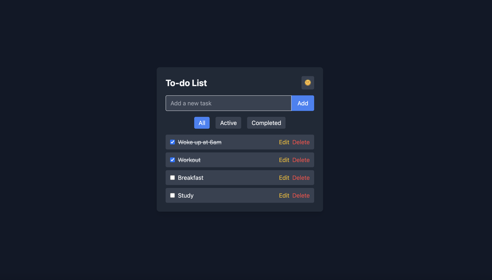
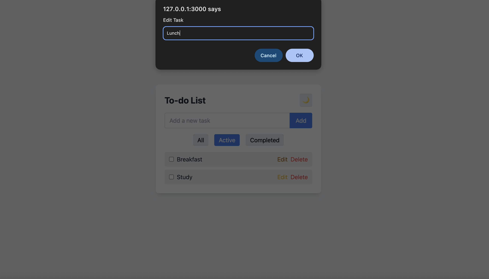

# 📝 To-Do List Web App

A simple and elegant **To-Do List** built using **HTML**, **Tailwind CSS**, and **JavaScript** — with support for **Dark/Light Mode**, **Task Filters**, **Editing**, and **LocalStorage** for saving tasks.

##screenshot





## 🚀 Features

✅ Add new tasks easily  
✅ Mark tasks as **completed / active**  
✅ Edit or delete existing tasks  
✅ Filter tasks — **All / Active / Completed**  
✅ Dark & Light theme toggle 🌙 / 🌞  
✅ Automatically saves tasks using **LocalStorage**  
✅ Fully responsive and clean UI with **Tailwind CSS**

---

## 🖥️ Tech Stack

- **HTML5**
- **Tailwind CSS** (via CDN)
- **Vanilla JavaScript**
- **LocalStorage** for data persistence


---

## ⚙️ How to Run Locally

### Clone this repository
```bash
git clone https://github.com/codewithyasu/to-do-List.git

🧑‍💻 Author
Yasmeen Shaikh (codewithyasu)


